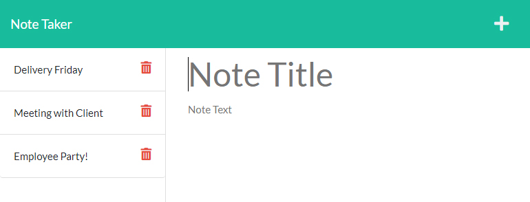

# Tasks Note Taker

[](https://opensource.org/licenses/MIT)

## Description

This web application was built as a helpful tool for keeping track of tasks as saved notes hosted on Heroku. The app uses Express.js for the back end server functions pulling JSON data from a database file. By deploying the code to Heroku, the database is persistent across multiple machines through a server so that the user can come back to the app later without losing valuable task notes. The app’s functionality includes a delete process so that the user can clear out finished tasks easily. I gained valuable experience in routing page display and api paths through a master index.js file which will allow for expanded functionality in the future.

## User Story

```
AS A small business owner
I WANT to be able to write and save notes
SO THAT I can organize my thoughts and keep track of tasks I need to complete
```

## Live Site

https://tasks-note-taker.herokuapp.com/



## Technologies
- Node.js
- Express.js
- uniqid

## License
Licensed under the MIT License - https://opensource.org/licenses/MIT

## Contact

If you have any questions you can email me at williamcrownover1@gmail.com.

You can also check out my other work on GitHub at [WilliamCrownover](https://github.com/WilliamCrownover)
